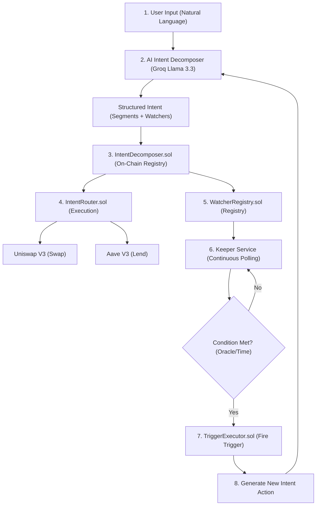

# 🛡️ Sigil — Persistent Intent Engine on Arbitrum

[](https://soliditylang.org/)
[](https://book.getfoundry.sh/)
[](https://nextjs.org/)
[](https://groq.com/)
[](LICENSE)
[]()
[]()

Inscribe your financial intent once. It watches, reacts, and protects — completely autonomously. Sigil is a first-of-its-kind persistent intent system built for the Arbitrum network where user intents automatically renew and execute themselves based on dynamic on-chain triggers.

---

## 📖 Table of Contents

- [🎯 Core Concept & Vision](#-core-concept--vision)
- [✨ Key Features](#-key-features)
- [🔄 The Persistent Intent Loop (How it Works)](#-the-persistent-intent-loop-how-it-works)
- [📁 Project Structure](#-project-structure)
- [🚀 Quick Start (Installation & Setup)](#-quick-start-installation--setup)
  - [Prerequisites](#prerequisites)
  - [1. Smart Contracts Setup](#1-smart-contracts-setup)
  - [2. Backend Setup](#2-backend-setup)
  - [3. Frontend Setup](#3-frontend-setup)
- [🏗️ Smart Contract Architecture](#%EF%B8%8F-smart-contract-architecture)
  - [Core Contracts](#core-contracts)
  - [Protocol Adapters](#protocol-adapters)
- [🤖 AI Intent Decomposer Service](#-ai-intent-decomposer-service)
- [⏱️ Keeper Service (The Loop Closer)](#%EF%B8%8F-keeper-service-the-loop-closer)
- [💻 Web Dashboard & UX](#-web-dashboard--ux)
- [🧪 Testing & Verification](#-testing-&amp;-verification)
- [🏆 Arbitrum Open House London Buildathon Alignment](#-arbitrum-open-house-london-buildathon-alignment)
- [📝 License](#-license)

---

## 🎯 Core Concept & Vision

Every DeFi intent system today follows the same strict, fire-and-forget lifecycle:

$$\text{User signs intent} \implies \text{Solver competes} \implies \text{Execution} \implies \text{Intent dies}$$

But real financial goals are not one-shot. "Hedge my ETH by 30% and exit my yield positions if a protocol I am in suffers a 20% TVL drop" requires continuous vigilance, dynamic decisions, and multiple transactions over time. 

Today, the trigger layer remains off-chain, reliant on centralized bots, keepers, or cron jobs that can fail, go offline, or be censored.

**Sigil solves this by making intents persistent.** 

After the initial solver executes immediate actions, the intent remains alive. On-chain Watchers monitor the state. When conditions are met, the system autonomously submits and executes a new intent, closing the loop.

---

## ✨ Key Features

1. **Natural Language AI Intent Decomposer**: Translate free-text financial goals (e.g., *"Swap 1 ETH to USDC now. If ETH drops below $3500, exit everything to USDC"* ) into structured smart contract parameters using **Llama 3.3 70B** via the high-speed **Groq SDK**.
2. **Persistent On-Chain Watchers**: Monitor conditions directly on-chain. Supported watchers include:
   - **Price Watchers**: Chainlink oracle-driven price triggers (LT, GT, GTE, LTE).
   - **Time Watchers**: Recurring interval-based execution (e.g., weekly DCA, rebalancing).
   - **Risk Watchers**: TVL drop tracking and contract upgrade alerts.
   - **Governance Watchers**: Protocol proposal monitoring.
3. **Atomic Protocol Execution**: Route immediate actions and future triggered actions through the **IntentRouter** using modular protocol adapters (e.g., **Uniswap V3** for swaps, **Aave V3** for lending).
4. **Autonomous Keeper Network**: A decentralized runner that polls watchers and executes triggers, closing the loop by automatically generating new intents without user intervention.

---

## 🔄 The Persistent Intent Loop (How it Works)

The workflow consists of five distinct phases that form a continuous cycle:



1. **Inscribe**: User writes a natural-language goal in the frontend dashboard.
2. **Decompose**: The AI service parses the text into **Immediate Segments** (actions to run now) and **Persistent Watchers** (conditions to monitor).
3. **Submit & Execute**: The frontend submits the intent to the `IntentDecomposer` contract. Immediate segments execute via the `IntentRouter` using DEX and lending adapters.
4. **Register Watchers**: The remaining config registers as live, persistent entities in the `WatcherRegistry`.
5. **Close the Loop**: The backend `Keeper` polls active watchers. When a threshold triggers, it calls `TriggerExecutor.sol`, which executes the actions and registers a new intent, resetting the loop.

---

## 📁 Project Structure

This project is set up as a monorepo containing contracts, backend services, shared models, and a Next.js frontend app:

```
/home/precious/projects/Sigil/sigil/
├── contracts/          # Foundry project for Solidity smart contracts
│   ├── src/            # Core Protocol contracts (Registry, Decomposer, Router, Executor)
│   │   ├── adapters/   # Uniswap V3 and Aave V3 protocol adapters
│   │   └── base/       # SigilBase for access controls and recovery mechanics
│   ├── script/         # Deployment and verification scripts
│   └── test/           # Comprehensive Foundry tests (Unit & Integration)
├── backend/            # Express.js + TypeScript service
│   ├── src/            # Core logic and endpoints
│   │   ├── contracts/  # Ethers.js v6 bindings and ABIs
│   │   └── services/   # AI Decomposer & Keeper polling service
│   └── tsconfig.json   # TypeScript configuration
├── frontend/           # Next.js 16 app using TailwindCSS & Lucide icons
│   ├── app/            # App router pages (Dashboard, Cast, History)
│   ├── components/     # Interactive UI widgets (Timeline, Decomposer, Wallet connectors)
│   ├── stores/         # Zustand global state management
│   └── styles/         # CSS design systems (Vanilla CSS + Tailwind)
└── shared/             # TypeScript interfaces and constants shared across packages
```

---

## 🚀 Quick Start (Installation & Setup)

### Prerequisites
- **Node.js** v18+ and npm
- **Foundry** (for smart contracts development)
- **Groq API Key** (Get it free at [console.groq.com](https://console.groq.com/))
- **Arbitrum Sepolia ETH** for testing on-chain transactions

---

### 1. Smart Contracts Setup

1. Navigate to the contracts directory:
   ```bash
   cd sigil/contracts
   ```
2. Install Foundry dependencies:
   ```bash
   forge install
   ```
3. Compile smart contracts:
   ```bash
   forge build
   ```
4. Run the suite of 94 tests (100% pass, covering unit and end-to-end integration):
   ```bash
   forge test -vv
   ```
5. Deploy to Arbitrum Sepolia:
   ```bash
   cp .env.example .env
   # Add your PRIVATE_KEY and ARBISCAN_API_KEY to .env
   
   forge script script/DeploySigil.s.sol:DeploySigil \
     --rpc-url $ARBITRUM_SEPOLIA_RPC \
     --broadcast \
     --verify
   ```

---

### 2. Backend Setup

The backend hosts the Llama 3.3 AI decomposer and the automated keeper loop.

1. Navigate to the backend directory:
   ```bash
   cd ../backend
   ```
2. Install dependencies:
   ```bash
   npm install
   ```
3. Set up environment variables:
   ```bash
   cp .env.example .env
   ```
   Configure the following in your `.env`:
   - `GROQ_API_KEY`: Your Groq Developer key.
   - `PRIVATE_KEY`: Your wallet's private key (must hold Sepolia ETH).
   - `ARBITRUM_SEPOLIA_RPC_URL`: Arbitrum Sepolia RPC endpoint.
   - `AUTO_START_KEEPER`: Set to `true` to run keeper checks immediately.
4. Run the development server:
   ```bash
   npm run dev
   ```
   The API will listen on `http://localhost:3001`.

---

### 3. Frontend Setup

The frontend provides a state-of-the-art UI dashboard to interact with the protocol.

1. Navigate to the frontend directory:
   ```bash
   cd ../frontend
   ```
2. Install dependencies:
   ```bash
   npm install
   ```
3. Configure the environment variables:
   Create a `.env.local` containing the contract addresses deployed in Step 1:
   ```env
   NEXT_PUBLIC_INTENT_DECOMPOSER=0xDaf6B30C15a0Ce8501A685f0606154F517b8d62a
   NEXT_PUBLIC_WATCHER_REGISTRY=0xB3073A12EBD1ffE05B9Bd530A50625779AB8E93d
   NEXT_PUBLIC_TRIGGER_EXECUTOR=0xE80dd053081b941FBfF60eB8b105bBF4f971327a
   NEXT_PUBLIC_INTENT_ROUTER=0x2D514AB7E8C2F05FA82Bb4885de00Da933501022
   NEXT_PUBLIC_MOCK_PRICE_FEED=0xd30e2101a97dcbAeBCBC04F14C3f624E67A35165
   NEXT_PUBLIC_ARBITRUM_SEPOLIA_RPC=https://sepolia-rollup.arbitrum.io/rpc
   ```
4. Launch the web app:
   ```bash
   npm run dev
   ```
   Open `http://localhost:3000` to interact with the dashboard.

---

## 🏗️ Smart Contract Architecture

The protocol is built using a decoupled architecture separating registry, evaluation, and routing layers:

```
                                 ┌─────────────────────────┐
                                 │     IntentRouter        │
                                 └────────────┬────────────┘
                                              │
                       ┌──────────────────────┴──────────────────────┐
                       ▼                                             ▼
            ┌─────────────────────┐                       ┌─────────────────────┐
            │   UniswapV3Adapter  │                       │    AaveV3Adapter    │
            └─────────────────────┘                       └─────────────────────┘
                       ▲                                             ▲
                       │                  Checks                     │
┌──────────────────────┴───────┐       Oracle Prices        ┌────────┴────────────────────┐
│      IntentDecomposer        ├───────────────────────────>│       WatcherRegistry       │
│   (ERC-8004 AI identity)     │                            │     (THE CORE WATCHERS)     │
└──────────────┬───────────────┘                            └─────────────┬───────────────┘
               │                                                          │
               │                                                          │
               │                        Triggers                          │
               └──────────────────────────────────────────────────────────┘
```

### Core Contracts

1. **`WatcherRegistry.sol` (The Core IP)**: Stores persistent watchers on-chain. Provides batch checks (`checkWatchers`) for gas efficiency. Links to Chainlink aggregators for price thresholds and tracks user watchers in an optimized $O(1)$ lookup mapping.
2. **`IntentDecomposer.sol`**: Authorizes AI agents utilizing the **ERC-8004** identity standard. Resolves submitted intents into active state arrays and handles lifecycle modifications (e.g. cancellations).
3. **`IntentRouter.sol`**: Executes decomposed actions atomically. Employs the adapter pattern to support Uniswap, Aave, Camelot, and GMX routing.
4. **`TriggerExecutor.sol`**: The entry point for the Keeper Network. Verifies conditions, pays out execution rewards, triggers state transitions, and creates new follow-on intents.

### Protocol Adapters

- **`UniswapV3Adapter.sol`**: Manages on-chain token swaps with customizable slippage controls.
- **`AaveV3Adapter.sol`**: Interacts with lending pools, allowing automated supply, borrow, repay, and withdraw operations.

---

## 🤖 AI Intent Decomposer Service

The backend utilizes **Llama 3.3 70B** via Groq to parse user inputs. It enforces strict JSON schemas, generating structures ready for Solidity ABI-encoding.

### Example Decomposition

**User Input:**
> "Swap 1 ETH to USDC and check the price, if ETH drops below $3000 swap back."

**Groq JSON Response:**
```json
{
  "segments": [
    {
      "type": "SWAP",
      "protocol": "uniswap-v3",
      "description": "Swap 1 ETH to USDC",
      "data": {
        "tokenIn": "0xe2b4885de00da933501022...",
        "tokenOut": "0x315bbdfe5ea6f2083c55...",
        "amountIn": "1.0",
        "minAmountOut": "2900"
      }
    }
  ],
  "watchers": [
    {
      "type": "PRICE",
      "description": "Monitor ETH/USD price below $3000",
      "params": {
        "pair": "ETH/USD",
        "threshold": "3000",
        "comparison": "LT"
      }
    }
  ],
  "reasoning": "Swap ETH to USDC now and configure a price watcher to swap USDC back to ETH if the price falls below $3000."
}
```

---

## ⏱️ Keeper Service (The Loop Closer)

The Keeper Service (`sigil/backend/src/services/keeper.ts`) closes the loop of persistent intents:
- It runs a polling engine checking registered watchers every block (approx 12 seconds).
- It verifies conditions (e.g., checks current oracle prices against watcher parameters).
- Once triggered, it signs a transaction executing `TriggerExecutor.checkAndExecute()`.
- The execution initiates the watcher's next actions on-chain, automatically registering a follow-up intent to keep the strategy active.

---

## 💻 Web Dashboard & UX

The frontend web app incorporates modern Web3 UX principles:
- **Wallet Connection**: Smooth onboarding using RainbowKit and Wagmi.
- **Context-Aware Mode Display**: Shows dynamic status indicators based on network connection:
  - 🟣 **Demo Mode**: Wallet disconnected; loads mock simulation tickers.
  - 🟡 **Wrong Network**: Alerting users to switch to Arbitrum Sepolia.
  - 🟢 **On-chain Mode**: Real-time blockchain execution and watcher updates.
- **Timeline Feed**: Interactive vertical timelines showing active intents, triggered events, and current oracle logs.

---

## 🧪 Testing & Verification

### Smart Contracts Test Suite
Run the full test suite using Foundry:
```bash
cd sigil/contracts
forge test -vv
```

To run only the end-to-end integration loop tests:
```bash
forge test --match-contract EndToEndTest -vv
```

### Backend API Tests

**Health Check:**
```bash
curl http://localhost:3001/health
```

**Decompose NLP Intent:**
```bash
curl -X POST http://localhost:3001/decompose \
  -H "Content-Type: application/json" \
  -d '{
    "text": "Swap 0.5 ETH to USDC and watch price, if ETH goes above $4000 swap to Aave lending pool",
    "userAddress": "0x1234567890123456789012345678901234567890"
  }'
```

**View Keeper Service Metrics:**
```bash
curl http://localhost:3001/keeper/stats
```

---

## 🏆 Arbitrum Open House London Buildathon Alignment

Sigil is custom-built to showcase the power of the Arbitrum ecosystem:

| Category | How Sigil Fits |
|---|---|
| **DeFi: Intent-based DeFi** | Fully persistent intents that don't die after a single execution. |
| **AI Agents in Web3** | AI agent identity validation via ERC-8004, translating goals to on-chain instructions. |
| **Autonomous Ecosystems** | Machine-to-machine trigger actions, combining Oracles, smart contracts, and Keeper loops. |
| **Optimized execution** | Arbitrum's sub-second finality and cheap gas costs make persistent watcher updates and trigger loops economically viable. |

---

## 📝 License

Distributed under the MIT License. See `LICENSE` for more information.

---

**Built with ❤️ for the future of persistent intents on Arbitrum. The Loop Closes Here! 🔗🚀**